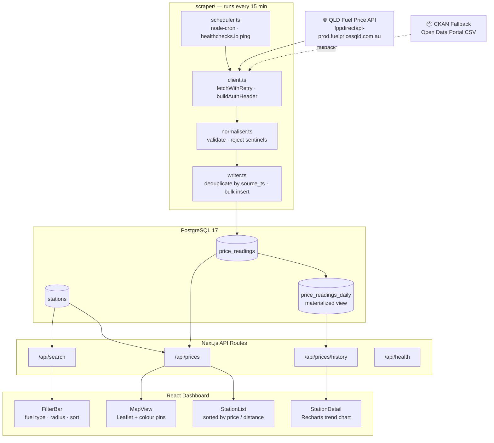
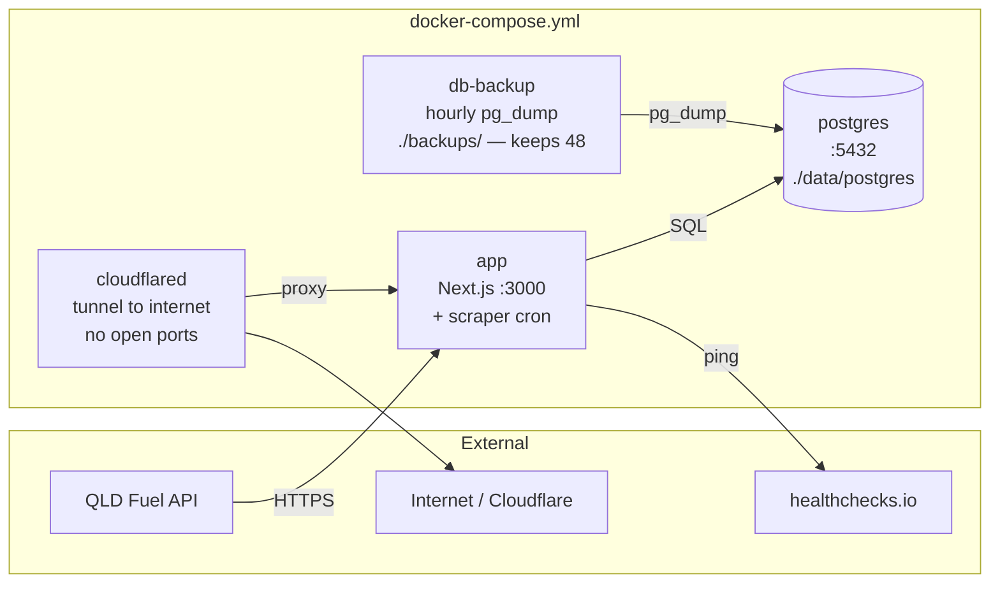

# ⛽ FuelSniffer

Real-time Queensland fuel price tracker — map view, price trends, and radius-based filtering. Self-hosted, scrapes every 15 minutes.

**Features:** interactive station map · 7-day price history · radius filtering · 7 fuel types · scraper health monitoring · invite-only access

---

## Architecture

### Data Pipeline



### Docker Services



---

## Quick Start

```bash
cp .env.example .env
# Set DB_PASSWORD, QLD_API_TOKEN, SESSION_SECRET, DATABASE_URL

openssl rand -base64 32   # → use as SESSION_SECRET

docker compose build
docker compose up -d
```

App available at **http://localhost:3000**. Runs migrations on first boot, then fetches ~7 000 QLD price readings. Scrapes every 15 minutes thereafter.

## Environment Variables

| Variable | Required | Description |
|----------|----------|-------------|
| `DB_PASSWORD` | Yes | PostgreSQL password for the `fuelsniffer` user |
| `DATABASE_URL` | Yes | `postgresql://fuelsniffer:<DB_PASSWORD>@localhost:5432/fuelsniffer` |
| `QLD_API_TOKEN` | Yes | Token from fuelpricesqld.com.au — register free as "data consumer" |
| `SESSION_SECRET` | Yes | High-entropy string for JWT signing (32+ chars) |
| `HEALTHCHECKS_PING_URL` | No | healthchecks.io URL for scraper dead-man's-switch |

## Tech Stack

| Layer | Technology | Purpose |
|-------|-----------|---------|
| Backend | Next.js 16 | App Router · API routes |
| Backend | PostgreSQL 17 | Time-series + materialized views |
| Backend | Drizzle ORM | Schema + plain SQL migrations |
| Backend | node-cron | 15-min scrape schedule |
| Backend | jose | JWT sessions |
| Frontend | React 19 | Dashboard UI |
| Frontend | Tailwind CSS 4 | Styling |
| Frontend | Leaflet | Interactive station map |
| Frontend | Recharts | Price trend charts |
| Frontend | date-fns | AEST/AEDT date helpers |

## API Endpoints

| Endpoint | Description |
|----------|-------------|
| `GET /api/prices?fuel=2&lat=-27.47&lng=153.02&radius=10` | Current prices near a location, sorted by price |
| `GET /api/prices/history?station=123&fuel=2&hours=168` | 7-day hourly price history for a station |
| `GET /api/search?q=coles` | Search stations by name or suburb |
| `GET /api/health` | Scraper status — last run time, price count, error state |

## Development

```bash
npm install
docker compose up -d postgres
npx tsx src/lib/db/migrate.ts
npm run dev          # http://localhost:3000 (Turbopack)

npm test             # Vitest unit tests
npx tsc --noEmit     # Type check
```

## Database Migrations

Plain SQL files in `src/lib/db/migrations/`. Applied automatically on container startup. To add one:

```bash
# Create a new numbered file
src/lib/db/migrations/0006_my_change.sql
# Restart the app container — it applies automatically
```

## Docker Services

| Service | Purpose |
|---------|---------|
| `postgres` | PostgreSQL 17, data in `./data/postgres` |
| `app` | Next.js app + scraper scheduler, port 3000 |
| `db-backup` | Hourly `pg_dump` to `./backups/`, retains last 48 |
| `cloudflared` | Cloudflare tunnel — remove if not needed |

## Backup & Restore

```bash
# Restore from latest backup
gunzip -c ./backups/latest.sql.gz | \
  docker exec -i fuelsniffer-postgres-1 psql -U fuelsniffer -d fuelsniffer
```

## Docker Build Notes

The `package-lock.json` is macOS-generated and lacks `@tailwindcss/oxide-linux-arm64-musl`. The Dockerfile explicitly installs it after `npm ci`. Do not remove this step.

---

Data sourced from the [Queensland Government Fuel Price API](https://www.fuelpricesqld.com.au). Register free as a "data consumer" to get an API token.
