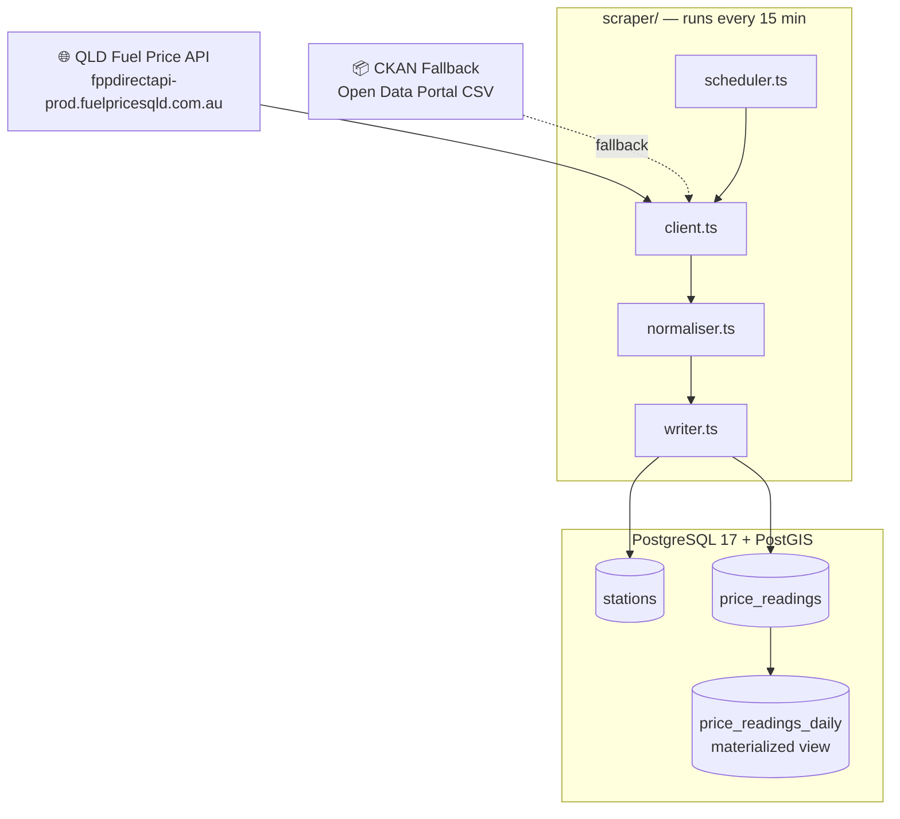

# ⛽ Fillip

Fillip helps Australian drivers find the cheapest fuel near them and along their route. Real-time prices, trend tracking, and (rolling out) national coverage. Self-hosted; scrapes every 15 minutes.

> Formerly known as **FuelSniffer** (QLD-only beta). The Fillip rebrand is rolling out in phases — see `docs/superpowers/specs/2026-04-22-fillip-master-design.md`.

**Status:** SP-0 (rebrand + foundations) shipped. SP-1 (national data adapters) and SP-2 (auth v2) next.

**Public URL (when deployed):** https://fillip.clarily.au

---

## Architecture

### Data Pipeline



### Stack

| Layer | Tech |
|---|---|
| Framework | Next.js 16 (App Router) + React 19 + TypeScript |
| DB | PostgreSQL 17 + PostGIS, accessed via Drizzle ORM |
| Scraper | node-cron, runs inside Next.js via `src/instrumentation.ts` |
| Map | Leaflet + leaflet.markercluster |
| Charts | Recharts |
| Auth (today) | JWT sessions via `jose`, invite-code signup. **SP-2 replaces with magic link + Google/Apple OAuth.** |
| Tests | Vitest 4 + @testing-library/react + Playwright |
| Hosting | Docker Compose (postgres + app + db-backup + cloudflared tunnel) |

---

## Local development

```bash
cp .env.example .env
# fill in DB_PASSWORD, QLD_API_TOKEN, SESSION_SECRET, MAPBOX_TOKEN
docker compose up -d postgres
cd fuelsniffer  # this folder; rename deferred per SP-0 spec §10 Q4
npm install --legacy-peer-deps
npm run dev   # http://localhost:4000
```

> Use `npm install --legacy-peer-deps` until Storybook 9 is released (currently used in SP-3 for component dev; `@storybook/nextjs` 8.x doesn't support Next 16's peer constraint).

Tests:

```bash
npm run test:run    # Vitest unit + integration
npm run test:e2e    # Playwright smoke
```

---

## Theme

Fillip ships with both a light and a dark theme. The theme toggle is the floating button in the bottom-right corner.

- **Default:** System (follows your OS).
- **Persistence:** Choice is stored in `localStorage` and a `fillip-theme` cookie so the SSR pass renders the right theme on first paint.
- **Override at deploy:** `APP_DEFAULT_THEME=light|dark|system` env var.

Component-level visual polish (especially light mode for inline-styled cards) is owned by SP-3 (UX core). SP-0 ships a *functional* dark theme that matches the legacy FuelSniffer look pixel-for-pixel.

---

## Roadmap

See `docs/superpowers/specs/2026-04-22-fillip-master-design.md` for the master design and `2026-04-22-fillip-sp{0..8}-*-design.md` for each sub-project.

| | Sub-project | Status |
|---|---|---|
| SP-0 | Rebrand + foundations | ✅ shipped |
| SP-1 | National data adapters (NSW/WA/NT/TAS/ACT) | next |
| SP-2 | Auth v2 (magic link + Google/Apple) | next |
| SP-3 | UX core (proper dark mode, PWA, perf, a11y) | next |
| SP-4 | Cycle engine Phase A (predictive) | queued |
| SP-5 | Alerts (email + web push) | queued |
| SP-6 | True-cost prices (loyalty) | queued |
| SP-7 | Trip planner polish | queued |
| SP-8 | Viral hooks (share-card + bot) | queued |
